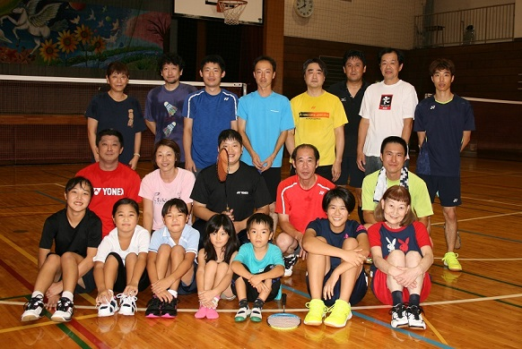
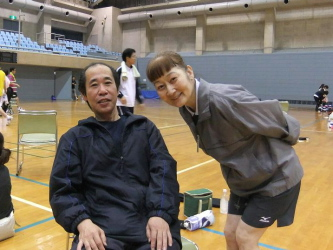

# どんなクラブ？

## クラブについて
和気あいあいと楽しいバドを目指して活動しております(*^^)v  
東京都稲城市を中心に活動しているクラブです（*^_^*）  
特に女性の方・最低基礎打ちできる方　大歓迎！！

## 年齢層
10代 〜 60代の方と幅広いです。

## レベル
初級者の方から上級者まで

## 目的
和気藹々、楽しいバドミントンを目指しています。  
健康の為にバドしている人。  
ストレス発散の人。試合に出たい人。  
技術向上の目的の人。それぞれです...。  
レベルに合わせて、楽しいバドを致しましょう。 

## 活動日
毎週金曜日　PM 7:30〜21:30
会社帰りの方も、お食事の支度していらっしゃる方でも参加しやすい時間帯です。

## 活動場所
稲城市立稲城第４中学校　体育館
<iframe src="https://www.google.com/maps/embed?pb=!1m18!1m12!1m3!1d3242.263002410687!2d139.51572931481823!3d35.645891339517554!2m3!1f0!2f0!3f0!3m2!1i1024!2i768!4f13.1!3m3!1m2!1s0x6018faa4aa604ffb%3A0xb59ee1749412d45d!2z56iy5Z-O5biC56uL56iy5Z-O56ys5Zub5Lit5a2m5qCh!5e0!3m2!1sja!2sjp!4v1610367270149!5m2!1sja!2sjp" width="600" height="450" frameborder="0" style="border:0;" allowfullscreen="" aria-hidden="false" tabindex="0"></iframe>
敷地内に車を止める事も出来るので安心！！  
駐車場は、くろがねや側の道沿いにあります。  
最寄駅は、ＪＲ南武線「矢野口」で歩いても１０分位です。

## 参加費
会員/ビジター|一般/学生|金額(会員は、毎月の金額、ビジターは、毎回の金額です)
:---|:---:|:---:
会員|一般|1200円
|学生|600円
ビジター|一般|600円
 |学生|400円

## 練習参加資格
最低基礎打ち・ゲームが出来る事

## 代表
タイムリーの代表、根岸さん（左側の方）、長尾さん(右側の方)です！  
